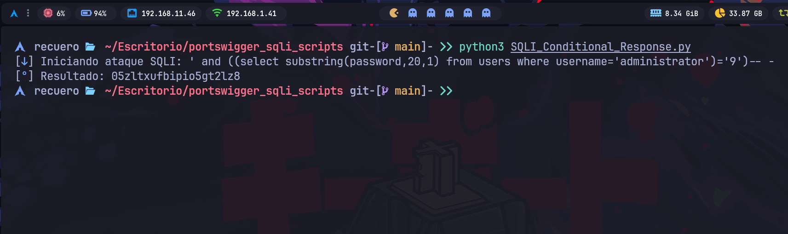

# PortSwigger SQLI Scripts
Scripts en Python para automatizar la extracción de datos vía **blind SQL injection** sobre los labs de [PortSwigger Web Security Academy](https://portswigger.net/web-security). Cada script implementa una técnica distinta de explotación ciega, extrayendo el password del usuario `administrator` carácter por carácter mediante fuerza bruta.

>El punto fuerte de estos scritps es el empleo de hilos mediante `ThreadPoolExecutor`, lo que acelera considerablemente la velocidad de la inyección.
>
>`ThreadPoolExecutor` es parte del módulo `concurrent.futures` y te permite ejecutar múltiples tareas en paralelo usando un **pool de hilos** (threads) reutilizables, en lugar de crear y destruir un hilo nuevo por cada tarea (que tiene overhead).

>[!Warning]
>**IMPORTANTE:**
>Para que funcione correctamente, debe adaptar los valores de **URL**, **TrackingId** y **session** a los que se correspondan en su laboratorio. Asegurése de cambiarlos antes de ejecutar los scripts.
## Contenido

|Script|Técnica|Motor SQL objetivo|
|---|---|---|
|`boolean_blind.py`|Boolean-based blind|Genérico (cláusula `AND`)|
|`error_based.py`|Error-based blind|Oracle (`to_char(1/0)`)|
|`time_based.py`|Time-based blind|PostgreSQL (`pg_sleep`)|

## Cómo funcionan
Los tres scripts comparten la misma estrategia general:
1. Inyectan un payload SQL dentro de la cookie `TrackingId`, probando si el carácter en una posición determinada del password coincide con uno de un conjunto candidato (`a-z`, `0-9`).
2. Usan `ThreadPoolExecutor` para probar hasta 35-36 caracteres en paralelo por cada posición, en lugar de uno a uno secuencialmente.
3. Detectan el carácter correcto según una señal distinta por técnica (ver tabla abajo), y van reconstruyendo el password posición por posición.
4. Usan `pwntools` (`pwn.log.progress`) únicamente para mostrar el progreso del ataque en consola de forma legible.

|Técnica|Señal de éxito|Cómo se detecta|
|---|---|---|
|Boolean-based|Cambio en la respuesta|El texto `"Welcome back"` aparece en el HTML cuando la condición es verdadera|
|Error-based|Error del servidor|Código de respuesta `500` cuando la condición fuerza una división por cero|
|Time-based|Retraso en la respuesta|La petición tarda más de 2.5s cuando la condición activa `pg_sleep(2.5)`|



***
## Requisitos

```bash
pip install -r requirements.txt
```

> `pwntools` arrastra dependencias pesadas (`unicorn`, `capstone`, etc.) porque es un framework de explotación binaria completo. Aquí solo se usa por su utilidad de logging (`pwn.log.progress`). Si prefieres algo más ligero, se puede sustituir por [`rich`](https://github.com/Textualize/rich) o [`tqdm`](https://github.com/tqdm/tqdm) sin cambiar la lógica del ataque.

>[!Note]
>### Uso de entorno virtual (venv) en python
>Puede usar un entorno virtual (Opcional pero recomendado):
>1. Crear entorno virtual
>``` bash
>python -m venv venv
>source venv/bin/activate # Linux/Mac
>venv\Scripts\activate # Windows
>```
>
>2. Instala las dependencias:
>```bash
>pip install -r requirements.txt
>```
>
>3. Corre el script:
>```bash
>python SQLI_*.py
>```
>***
>Cuando haya terminado, puede salir del entorno virtual ejecutando:
>``` bash
>deactivate # Windows/Linux /Mac
>```

***
## Uso

Cada script apunta a la URL del lab y a las cookies (`TrackingId`, `session`) específicas de la instancia activa. **Estos valores expiran** — antes de ejecutar, reemplázalos con los de tu propia instancia del lab:

```python
URL = "https://TU-LAB-ID.web-security-academy.net"
cookies = {
    'TrackingId': 'TU_TRACKING_ID',
    'session': 'TU_SESSION_COOKIE'
}
```

Luego, simplemente:

```bash
python3 boolean_blind.py
python3 error_based.py
python3 time_based.py
```

El resultado (password extraído) se imprime en tiempo real conforme se descubre cada carácter, gracias a `pwn.log.progress`.
***
## Notas técnicas

- **Concurrencia y cookies**: cada request construye su propio diccionario `cookies` local al hilo, evitando condiciones de carrera al mutar un diccionario compartido entre threads.
- **Rango de posiciones**: los scripts prueban posiciones del `1` al `20` (`range(1,21)`), asumiendo que el password no supera esa longitud. Ajusta el rango si lo necesitas.
- **`Ctrl+C`**: los tres scripts capturan `SIGINT` para salir limpiamente sin un traceback feo.

***
## Referencias
Estos scripts corresponden a los labs de inyección SQL ciega de PortSwigger Web Security Academy:
- [Blind SQL injection with conditional responses](https://portswigger.net/web-security/sql-injection/blind/lab-conditional-responses)
- [Blind SQL injection with conditional errors](https://portswigger.net/web-security/sql-injection/blind/lab-conditional-errors)
- [Blind SQL injection with time delays](https://portswigger.net/web-security/sql-injection/blind/lab-time-delays)

